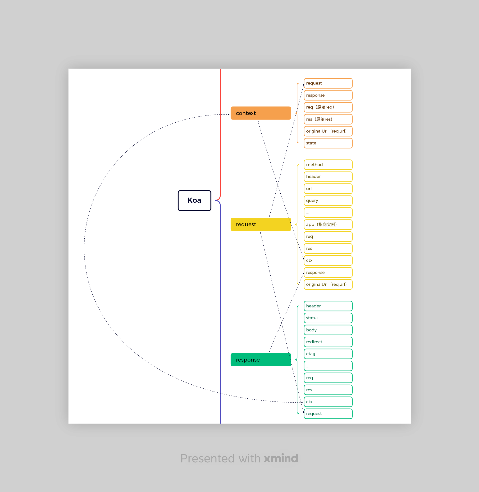
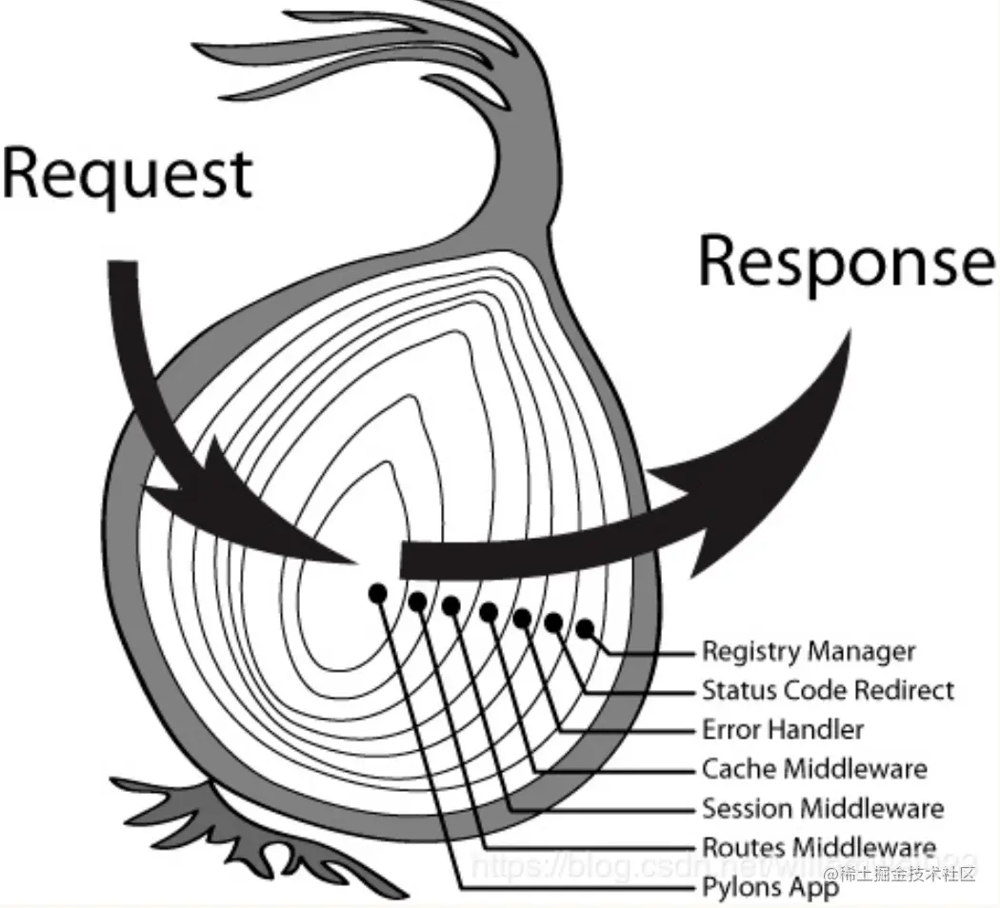

# Koa 源码解析

> Koa 是一个新的 web 框架，由 Express 幕后的原班人马打造， 致力于成为 web 应用和 API 开发领域中的一个更小、更富有表现力、更健壮的基石。 通过利用 async 函数，Koa 帮你丢弃回调函数，并有力地增强错误处理。 Koa 并没有捆绑任何中间件， 而是提供了一套优雅的方法，帮助您快速而愉快地编写服务端应用程序。

> 注：本文涉及到的一些思维导图在同目录下的xmind文件中

## 源码分析

### new Koa()做了什么

1. 进入`lib/application.js`文件，找到模块导出的地方，也就是`module.exports = class Application extends Emitter`。可以看到默认导出了一个`Application`类，这个类继承了 Emitter（涉及到 NodeJs 的事件模块。它具有发布订阅的功能，后面会用到）。

2. 在构造器中，给一些实例成员赋予一些默认值。比较重要的是 `compose`、`middleware`、`context`、`request`、`response`，全文也会围绕这几个属性进行介绍。`compose`和`middleware`属于洋葱模型里面的内容，会单独说到。你现在只需要知道，compose 是一个方法，middleware 是一个数组。

3. `context`、`request`、`response`的赋值都用到了`Object.create()`方法，通过这种方式实现继承。原型对象都在同级目录下，它们都导出了一个对象，并且有一个共同点，都存在toJSON的属性。他们之间会有怎样的联系？

4. 在`context.js`文件的最后，有一段比较特殊的代码。

```js
delegate(proto, "response")
  .method("attachment")
  .method("redirect")
  .method("remove")
  .method("vary")
  .method("has")
  .method("set")
  .method("append")
  .method("flushHeaders")
  .access("status")
  .access("message")
  .access("body");
// ...
```

`delegate`可以理解为代理，还出现了很多熟悉但又不是很熟悉的名词，又是在做什么？

### `app.use` 做了什么

这个方法实现很简单，就是往app实例的`middleware`属性中 push 了传入的函数。最后返回了当前实例，因此可以使用链式调用。

```js
if (typeof fn !== "function")
  throw new TypeError("middleware must be a function!");
debug("use %s", fn._name || fn.name || "-");
this.middleware.push(fn);
return this;
```

### 主角登场：`app.listen`

1. 只有成功调用了这个方法，才算真正运行起一个服务。毋庸置疑，肯定会在这个方法监听端口，接收请求并做出响应。

2. 可以看到，内部调用`http`内置模块的`http.createServer`方法创建新的 TCP 或 IPC 服务器，接着调用`listen`方法，这里会把传入的参数原封不动的传给`listen`方法。

3. 针对进来的请求如何给出响应，Koa 是如何处理的。实现是在调用`http.createServer`方法传入的参数中。

```js
callback () {
  // 组合中间件
  const fn = this.compose(this.middleware)

  // 如果没有error事件的订阅者，启用默认的错误订阅者。
  // 当抛出错误时，context的onerror会emit error事件，开发人员可以监听error事件来处理错误
  if (!this.listenerCount('error')) this.on('error', this.onerror)

  // 原生的req和res
  const handleRequest = (req, res) => {
    // 每个请求创建一个新的context
    const ctx = this.createContext(req, res)
    // 处理请求，执行中间件 —> res.end，包含错误处理逻辑
    return this.handleRequest(ctx, fn)
  }

  return handleRequest
}
```

简单来说：

- 调用compose方法对中间件进行组合
- 对error事件的监听，这里使用到了EventEmitter。至于什么时候会emit此事件，后续会提到
- 定义`handleRequest`函数。
- 返回`handleRequest`函数，因此每次请求进入将调用此回调函数。

4. `handleRequest`中首先调用`createContext`方法创建上下文。

- request属性初始化
- response属性初始化
- 保存原始的req和res
- `context`和`request`、`response`之间的循环引用
- `request`和`response`之间的循环引用

这也就是为什么他们都有`toJSON`的方法，如果没有的话在序列化时就会出现循环引用的问题。

如下图所见，列举出了一些属性，以及它们之间的关系（**注：仅列出了部分数据**）



5. 然后调用app实例上的`handleRequest`方法，这个方法接收两个参数，一个是上下文，一个是中间件函数。

```js
handleRequest (ctx, fnMiddleware) {
  const res = ctx.res
  res.statusCode = 404
  const onerror = err => ctx.onerror(err)
  const handleResponse = () => respond(ctx)
  onFinished(res, onerror)
  // fnMiddleware返回的是一个Promise
  return fnMiddleware(ctx).then(handleResponse).catch(onerror)
}
```

- 将statusCode默认设置为404
- 监听请求完成、关闭、出错时的错误
- 执行中间件，等待所有中间件执行，如果过程中出现异常，会emit`error`事件。
- 中间件执行完毕后，不同场景下进行响应的处理，最终调用`res.end()`结束请求。

## 核心思想

Koa的思想很简单，核心就是中间件机制。中间件机制的核心是洋葱模型，这个模型的核心是`compose`方法。

### 洋葱模型（koa-compose库）

为什么叫做洋葱模型，首先需要明白中间件的执行顺序

```js
app.use(async (ctx, next) => {
  console.log(1)
  await next()
  console.log(2)
})

app.use(async (ctx, next) => {
  console.log(3)
  await next()
  console.log(4)
})

app.use(async (ctx, next) => {
  console.log(5)
  await next()
  console.log(6)
})
```

打印的顺序是 1、3、5、6、4、2。先执行第一个中间件，遇到`await next()`，执行第二个中间件，遇到`await next()`，执行完第二个中间件，回到第一个中间件，执行完第一个中间件。

下面这张图就很生动的体现出了这个过程。

<!-- 插入图片 -->



根据之前的分析，compose方法需要返回一个函数，并且调用函数后会返回一个promise。

```js
function compose (middleware) {
  if (!Array.isArray(middleware)) throw new TypeError('Middleware stack must be an array!')
  for (const fn of middleware) {
    if (typeof fn !== 'function') throw new TypeError('Middleware must be composed of functions!')
  }

  /**
   * @param {Object} context
   * @return {Promise}
   * @api public
   */

  return function (context, next) {
    // last called middleware #
    let index = -1
    return dispatch(0)
    function dispatch (i) {
      // 判断是否调用了多次next
      if (i <= index) return Promise.reject(new Error('next() called multiple times'))
      index = i
      let fn = middleware[i]
      // 如果是最后一个中间件，next就是undefined
      if (i === middleware.length) fn = next
      // 如果没有中间件了，直接返回
      if (!fn) return Promise.resolve()
      try {
        // next就是下一个中间件函数
        return Promise.resolve(fn(context, dispatch.bind(null, i + 1)))
      } catch (err) {
        return Promise.reject(err)
      }
    }
  }
}
```

原理很简单，在内部定义了一个dispatch函数，接着调用`dispatch()`并返回。这是从头开始执行中间件，next函数就是dispatch函数，这样就形成了一个依次调用，并且可以等待下一个中间件**完全**执行完毕后继续执行`await next()`之后的代码。

上述示例执行的流程是：console.log(1) -> 执行第二个中间件 -> console.log(3) -> 执行第三个中间件 -> console.log(5) -> 执行完第三个中间件 -> console.log(6) -> 执行完第二个中间件 -> console.log(4) -> 执行完第一个中间件 -> console.log(2)

### 错误处理

通过发布订阅实现，这里不再详细介绍。**Koa默认会对这些错误进行处理，也允许用户设置错误监听回调**

### 委托模式（delegates库）

说回到上面，我们在给body赋值的时候，是通过给`context.body`进行赋值的。但是，我们在`context`上面是没有定义`body`属性的，这是怎么实现的呢？这和最开始提到的`delegate`以及列举的一些属性有关。

```js
function Delegator(proto, target) {
  // 是否通过new的方式调用（Vue的构造函数中也有这种用法）
  if (!(this instanceof Delegator)) return new Delegator(proto, target);
  this.proto = proto;
  this.target = target;
  this.methods = [];
  this.getters = [];
  this.setters = [];
  this.fluents = [];
}

/**
 * Delegate method `name`.
 *
 * @param {String} name
 * @return {Delegator} self
 * @api public
 */

Delegator.prototype.method = function(name){
  var proto = this.proto;
  var target = this.target;
  this.methods.push(name);

  // 代理方法
  proto[name] = function(){
    return this[target][name].apply(this[target], arguments);
  };

  return this;
};

/**
 * Delegator accessor `name`.
 *
 * @param {String} name
 * @return {Delegator} self
 * @api public
 */

Delegator.prototype.access = function(name){
  return this.getter(name).setter(name);
};

/**
 * Delegator getter `name`.
 *
 * @param {String} name
 * @return {Delegator} self
 * @api public
 */

Delegator.prototype.getter = function(name){
  var proto = this.proto;
  var target = this.target;
  this.getters.push(name);

  // 代理getter
  proto.__defineGetter__(name, function(){
    return this[target][name];
  });

  return this;
};

/**
 * Delegator setter `name`.
 *
 * @param {String} name
 * @return {Delegator} self
 * @api public
 */

Delegator.prototype.setter = function(name){
  var proto = this.proto;
  var target = this.target;
  this.setters.push(name);

  // 代理setter
  proto.__defineSetter__(name, function(val){
    return this[target][name] = val;
  });

  return this;
};
```

上面是`delegates`库的核心代码，可以看到，它通过`__defineGetter__`和`__defineSetter__`来实现代理。通过操作`context`的一些属性，来实现对`request`和`response`属性的代理。

通过给body赋值，此时的响应状态码已经修改为了200。

## 总结

1. Koa的中间件机制是洋葱模型，通过next函数实现依次调用，等待下一个中间件执行完毕后继续执行`await next()`之后的代码。
2. Koa的错误处理是通过发布订阅实现的，可以通过`app.on('error', (err) => {})`来监听错误。
3. Koa的`context`对象是通过委托模式实现的，通过`delegates`库实现。
4. 由于循环引用的问题，`context`、`request`、`response`的原型都定义了`toJSON`方法。
5. Koa的实现相对来说比较简单，所以灵活性比较高，可以根据自己的需求进行扩展。
6. Koa在中间件执行完成后内部调用了`req.end()`来结束请求。

## 注意

1. Koa的中间件机制是洋葱模型，但是如果在中间件中没有使用`await`，然后下一个中间件又是一个异步方法，那么顺序可能不会按照预想的执行。
2. 中间件执行顺序很重要